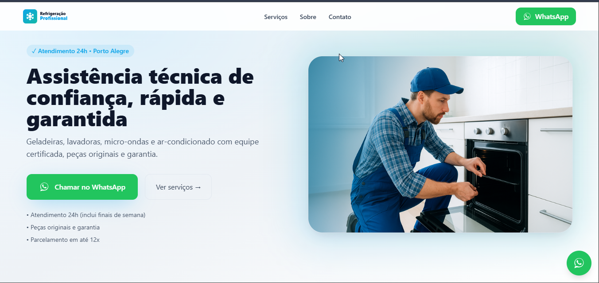
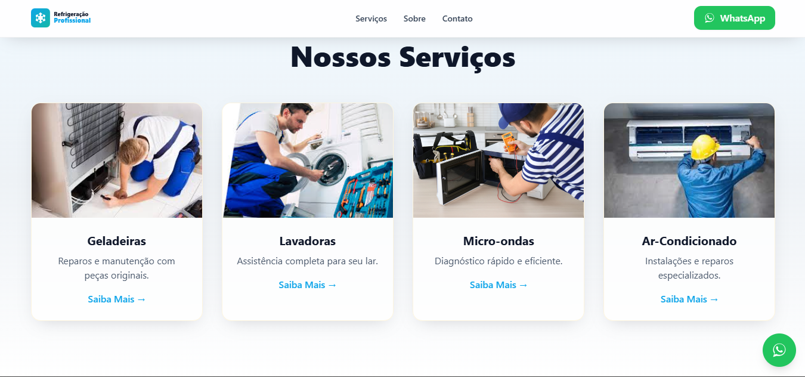
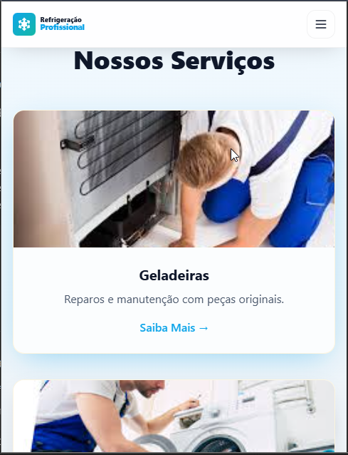
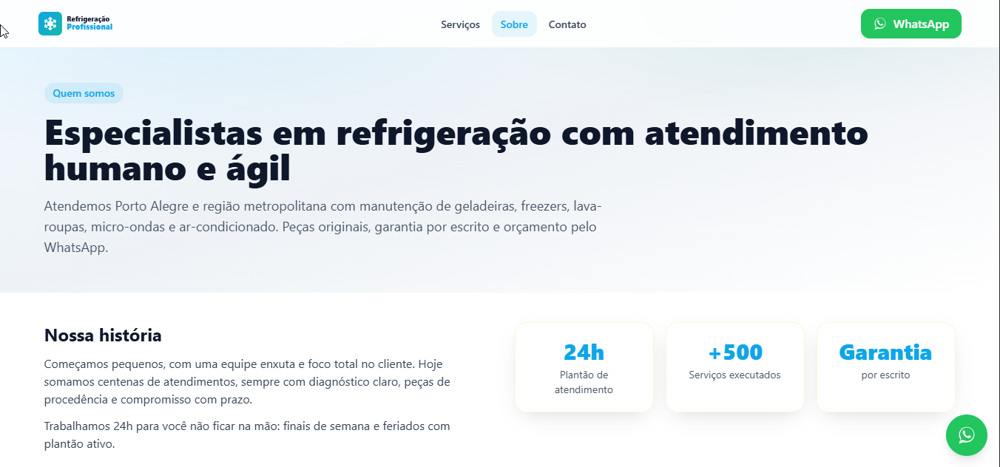
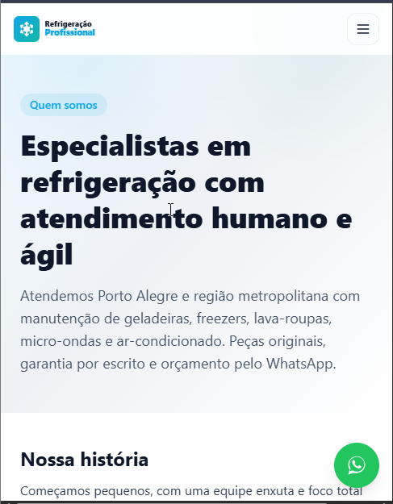
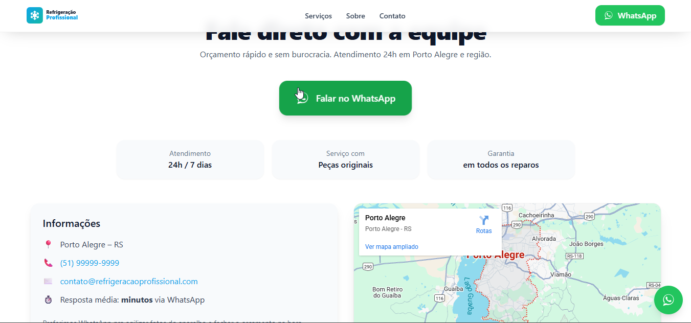
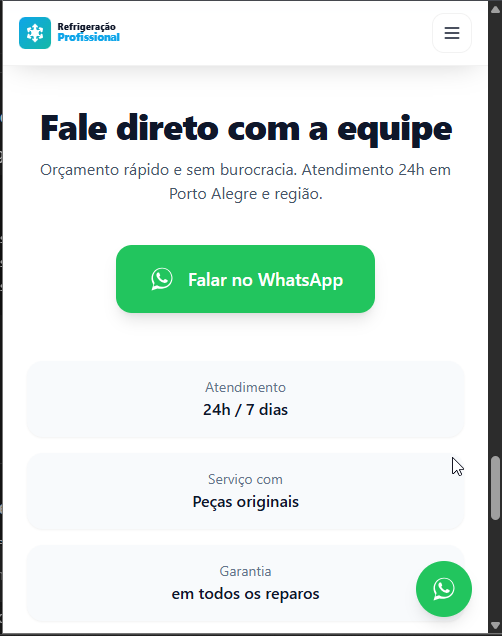

# ❄️ Refrigeração Profissional

Catálogo institucional moderno e responsivo, desenvolvido para divulgar os serviços de assistência técnica da **Refrigeração Profissional**, empresa especializada em **refrigeração doméstica e comercial** na região de **Porto Alegre (RS)**.

---

## 🧭 Visão Geral

O projeto foi construído como um **site estático**, leve e direto, priorizando:
- Navegação simples e responsiva;
- Comunicação clara dos serviços;
- Conversão rápida via **botão de WhatsApp**;
- Design limpo, em tons de azul e creme, reforçando a ideia de “frio e confiança”.

---

## 🧩 Páginas e Estrutura

```
📦 refrig-pro
 ┣ 📂 assets
 ┃ ┣ 📂 css
 ┃ ┃ ┗ style.css
 ┃ ┣ 📂 icons
 ┃ ┃ ┣ snowflake.svg
 ┃ ┃ ┗ whatsapp.svg
 ┃ ┣ 📂 img
 ┃ ┃ ┣ banner.png
 ┃ ┃ ┣ geladeira.jpg
 ┃ ┃ ┣ lavadora.jpg
 ┃ ┃ ┣ microondas.jpg
 ┃ ┃ ┣ ar-condicionado.jpg
 ┃ ┃ ┗ 📂 servicos
 ┃ ┣ 📂 js
 ┃ ┃ ┗ main.js
 ┃ ┗ 📂 logo
 ┃   ┣ favicon.svg
 ┃   ┣ refrigpro-icon.svg
 ┃   ┗ refrigpro-wordmark.svg
 ┣ 📂 servicos
 ┃ ┣ ar-condicionado.html
 ┃ ┣ geladeiras.html
 ┃ ┣ lavadoras.html
 ┃ ┗ micro-ondas.html
 ┣ index.html
 ┣ sobre.html
 ┣ manifest.json
 ┗ README.md
```

---

## 🧊 Destaques do Projeto

### 🏠 Página inicial (`index.html`)
- **Hero** com CTA direto para WhatsApp.  
- **Seção de serviços** (cards com hover e imagens).  
- **Diferenciais** (“Por que escolher a gente?”).  
- **Depoimentos animados** (AOS).  
- **Contato com mapa e botão de orçamento**.  
- **Header fixo com menu mobile (drawer lateral)**.  
- **Footer leve e elegante**, com botão WhatsApp integrado.

### 📖 Página “Sobre”
- Missão, visão e valores.  
- Blocos com efeito *glass* igual ao do index.  
- CTA para contato via WhatsApp.  

### 🧰 Outras páginas
- Páginas dedicadas em `/servicos/` para cada tipo de atendimento.  
- Manifesto PWA e ícones SVG otimizados.

---

## 🧠 Tecnologias Utilizadas

| Tecnologia | Função |
|-------------|--------|
| **HTML5** | Estrutura semântica do site |
| **TailwindCSS (CDN)** | Estilização rápida e responsiva |
| **JavaScript Vanilla** | Interações (menu, scroll, destaque de links) |
| **AOS.js** | Animações suaves ao rolar a página |
| **SVGs** | Ícones otimizados e escaláveis |
| **JSON-LD Schema** | SEO LocalBusiness configurado |

---

## ⚙️ Funcionalidades do `main.js`

✅ Atualização automática do ano no footer  
✅ Sombra dinâmica no header ao rolar  
✅ Menu mobile (abre/fecha com overlay escuro e trava de scroll)  
✅ Destaque automático de seção ativa no menu  
✅ Simulação de envio do formulário (modo demonstração)  

---

## 🎨 Personalização Rápida

### 🟢 1. Atualizar o WhatsApp
Procure por `wa.me/5551999999999` e substitua pelo seu número real.  
Exemplo:
```
https://wa.me/5551999123456?text=Olá!%20Quero%20um%20orçamento.
```

### 💙 2. Alterar cores da marca
As cores principais estão dentro do `<script>` no `<head>` do `index.html`:

```js
tailwind.config = {
  theme: { extend: {
    colors: {
      primary: "#0ea5e9",   // Azul principal
      secondary: "#14b8a6", // Verde-água
      surface: { soft:"#eef2f6", ring:"#e2e8f0" },
      cream: { DEFAULT:"#FFF4DC", soft:"#FFF9EF", bold:"#FFE8B3" }
    }
  }}
}
```

### 🖼️ 3. Trocar logo e favicon
| Tipo | Caminho |
|------|----------|
| Ícone quadrado | `assets/logo/refrigpro-icon.svg` |
| Logo wordmark | `assets/logo/refrigpro-wordmark.svg` |
| Favicon | `assets/logo/favicon.svg` |

---

## 📱 Menu Mobile (Drawer)

O menu lateral é controlado pelo `main.js` e composto por:

| ID | Função |
|----|---------|
| `#mobileDrawer` | Container geral com `z-[80]` |
| `#drawerOverlay` | Fundo escuro com opacidade (`bg-black/60`) |
| `#drawerPanel` | Painel branco que desliza lateralmente |
| `#openMenu` | Botão hambúrguer |
| `#closeMenu` | Botão de fechar (X) |

**Comportamentos automáticos:**
- Fecha ao clicar fora do painel.  
- Bloqueia o scroll da página enquanto aberto.  
- Anima com transição suave (300ms).  
- Fecha com tecla `ESC`.  

---

## 🧪 Testes Antes de Publicar

✔️ Todos os links de WhatsApp funcionam  
✔️ Menu mobile abre e fecha sem “vazar” atrás do conteúdo  
✔️ Imagens otimizadas (tente 360 px no celular)  
✔️ SEO básico: título e descrição aparecem corretos  
✔️ Favicon visível no navegador e no celular  

---

## 🚀 Como Rodar

Sem dependências. Basta abrir o arquivo `index.html`:

```bash
# ou com Live Server no VS Code
Alt + L + O
```

### Deploys recomendados:
- **Vercel / Netlify** → arraste o projeto  
- **GitHub Pages** → publique na branch `main`  
- **CPanel** → envie os arquivos para `public_html`

---

## 📸 Pré-visualizações do Projeto

Aqui estão algumas capturas de tela mostrando o layout do site em **versão desktop e mobile**.

| 💻 Versão Desktop | 📱 Versão Mobile |
|-------------------|-----------------|
|  |  |
|  |  |
|  |  |
|  |  |

> As capturas acima demonstram a responsividade e o design limpo do catálogo, com foco em conversão via WhatsApp e visual profissional para serviços de refrigeração.

---

## 🧾 Créditos e Licença

Criado com 💙 por **Debuguei Studio**  
Design, estrutura e interação por *GPT-5 + direção criativa Debuguei*.  
Uso livre e personalizável para catálogos institucionais.

© 2025 — **Refrigeração Profissional**. Todos os direitos reservados.  
🧊 *Catálogo web simples, rápido e eficaz.*
